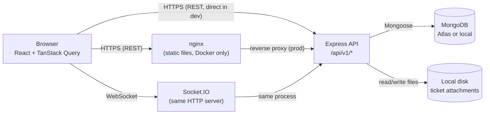
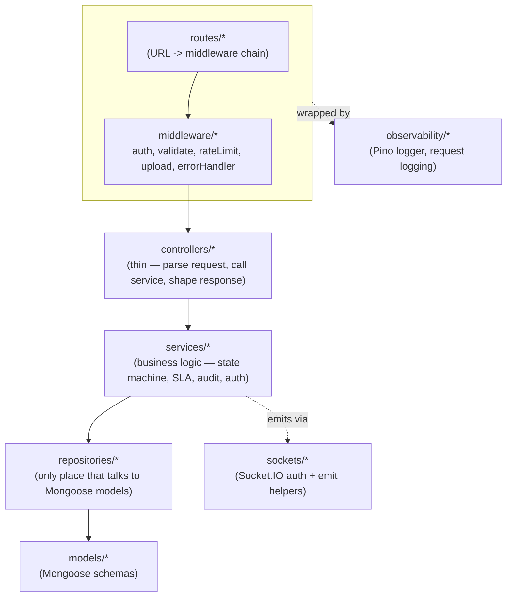
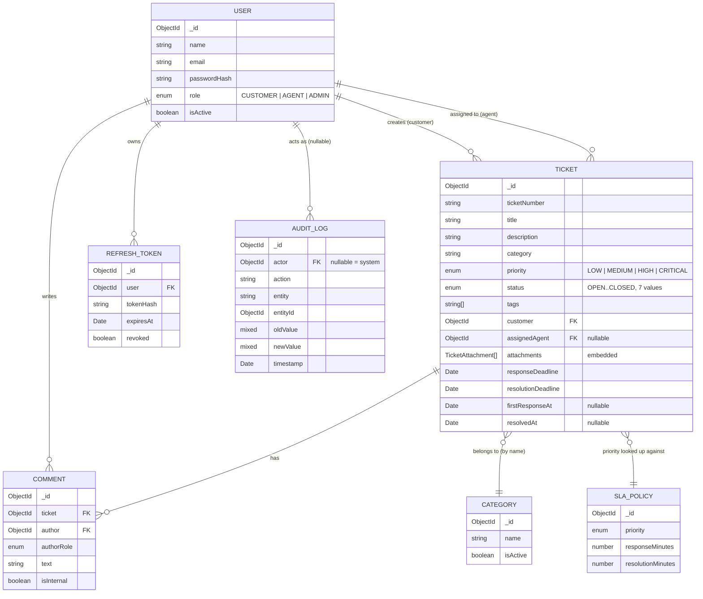
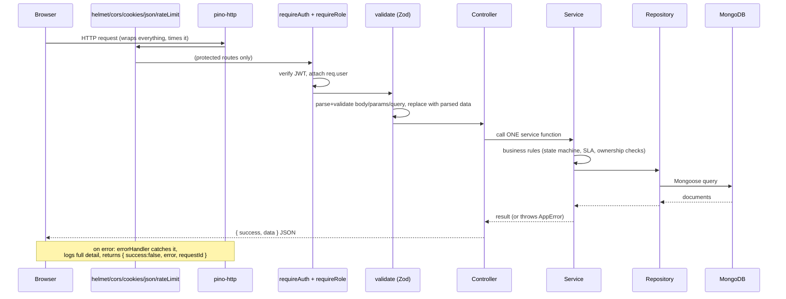
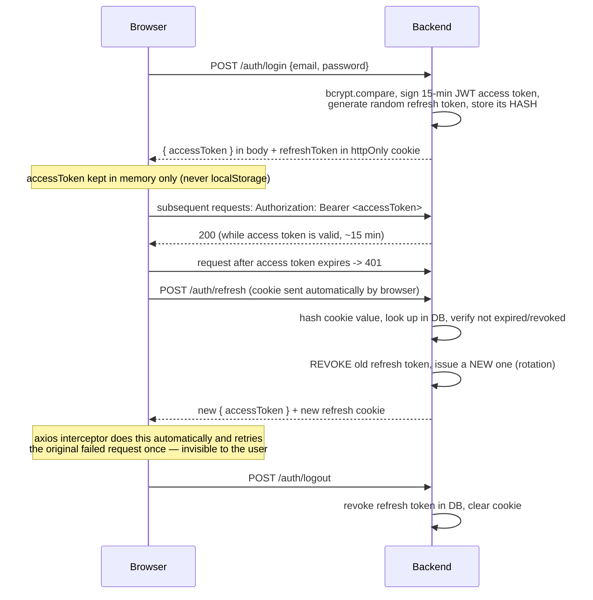

# Architecture

## System architecture

In development, the frontend (Vite dev server, :5173) calls the backend
(:4000) directly. In the Docker/production setup, nginx serves the built
static frontend and the browser still calls the backend API directly
(cross-origin, handled by CORS) — nginx here is a static file server, not
an API gateway; there is no server-side proxying to hide the backend's
location for this build.

## Component diagram (backend)

**Why this layering?** Each layer has exactly one job, and only talks to
the layer directly below it:

- **Routes** wire a URL + HTTP method to a chain of middleware + one
  controller function. No logic here beyond that wiring.
- **Middleware** answers cross-cutting questions that apply to many routes:
  "is this request authenticated?" (`auth.ts`), "is the body/query/params
  shaped correctly?" (`validate.ts`), "has this IP made too many requests?"
  (`rateLimit.ts`).
- **Controllers** are deliberately thin: read `req`, call ONE service
  function, shape the HTTP response (status code, `{ success, data }`
  envelope). No business rules live here.
- **Services** hold all business logic — the ticket state machine, SLA
  calculation, audit logging, auth token issuance. This is the layer unit
  tests target directly, without needing HTTP or a database.
- **Repositories** are the ONLY code that imports a Mongoose model and
  calls `.find()`/`.create()`/etc. If MongoDB were ever swapped for another
  database, only this layer changes.

This mirrors the "Controller → Service → Repository → Database" flow the
brief describes; we didn't invent a new shape, just implemented that one.

## Data model

### Embedded vs. referenced — and why

| Relationship | Choice | Why |
|---|---|---|
| Ticket → attachments | **Embedded** (array of subdocuments on the Ticket) | Attachments are always read/written together with their ticket, never queried independently, and there are at most a handful per ticket — no risk of hitting MongoDB's 16MB document size limit. Embedding avoids an extra query on every ticket-detail load. |
| Ticket → comments | **Referenced** (`Comment.ticket` FK) | A busy ticket could accumulate hundreds of comments over its lifetime — unbounded growth is exactly what embedding should avoid (a document that keeps growing forever risks that same 16MB ceiling, and forces loading the WHOLE comment history just to read the ticket's title). Comments are also independently paginated/filtered (internal vs. customer-visible), which is far more natural as its own collection. |
| Ticket → category | **Referenced by NAME (string), not ObjectId** | A deliberate denormalization. Analytics ("tickets by category") and filters group by this field constantly — storing the name directly avoids a `$lookup` join on every single read/aggregation. The cost: renaming a category doesn't retroactively relabel old tickets — for a support-ticket history, that's usually the CORRECT behavior anyway (a ticket keeps the label it had when it was filed). |
| Ticket → customer / assignedAgent | **Referenced** (ObjectId FK, populated on read) | Users are a genuinely separate entity with their own lifecycle (login, role changes, deactivation) — embedding a customer's data into every one of their tickets would duplicate it everywhere and go stale the moment they changed their name. |
| AuditLog → entity | **Referenced by ObjectId, generically** (`entity: "Ticket"`, `entityId: ObjectId`) | The audit log needed to point at users, tickets, categories, and SLA policies alike without four separate collections — a generic reference plus a type-tag string covers all of them with one schema. |

### Indexes (see `backend/src/models/Ticket.ts`)

| Index | Query pattern it serves |
|---|---|
| `{ status: 1 }` | Filtering the ticket list/queue by status alone |
| `{ assignedAgent: 1 }`, `{ customer: 1 }` | "My tickets" (customer) / "my queue" (agent) lookups |
| `{ assignedAgent: 1, status: 1, createdAt: -1 }` (compound) | The actual agent-queue query: filtered by agent AND status, sorted newest-first — one index satisfies filter AND sort together. Measured impact in [BUILD_LOG.md](BUILD_LOG.md#performance-pass). |
| `{ customer: 1, status: 1, createdAt: -1 }` (compound) | Same shape, customer-side ("My Tickets" filtered + sorted) |
| `{ priority: 1, status: 1 }` | Dashboard "critical tickets still open" style queries |
| `AuditLog: { entityId: 1 }`, `{ timestamp: 1 }` | "History for this ticket" / audit log browsing newest-first |
| `RefreshToken: { expiresAt: 1 }` (TTL index) | Automatic cleanup — MongoDB deletes expired refresh tokens itself |

### Potential scaling problems, honestly

- **`category` as a denormalized string** means renaming a category doesn't
  cascade to existing tickets (see table above) — a feature here, but worth
  knowing it's a deliberate trade-off if requirements ever change.
- **Regex search on `title`** (`ticketRepository.ts`) is fine at the scale
  tested (10k tickets — see [BUILD_LOG.md](BUILD_LOG.md#performance-pass))
  but doesn't scale to millions of documents or fuzzy/relevance-ranked
  search. A real search need would call for Atlas Search or a dedicated
  search engine (Elasticsearch/Meilisearch) — noted, not built.
- **Attachments on local disk** (`backend/uploads/`) don't survive a
  container being recreated unless the volume is preserved (docker-compose
  does mount a volume for this) and don't horizontally scale across
  multiple backend instances — a real multi-instance deployment would need
  S3-compatible object storage instead.
- **Socket.IO's in-memory room state** is per-process — running multiple
  backend instances behind a load balancer would need the Socket.IO Redis
  adapter so a socket connected to instance A still receives an event
  emitted from instance B. Not needed at this project's scale (single
  instance), flagged for anyone scaling it up.

## Request lifecycle

## Authentication flow

Full trade-off discussion (why access+refresh instead of one long-lived
token, why httpOnly cookie vs. localStorage) in
[DECISIONS.md](DECISIONS.md).
